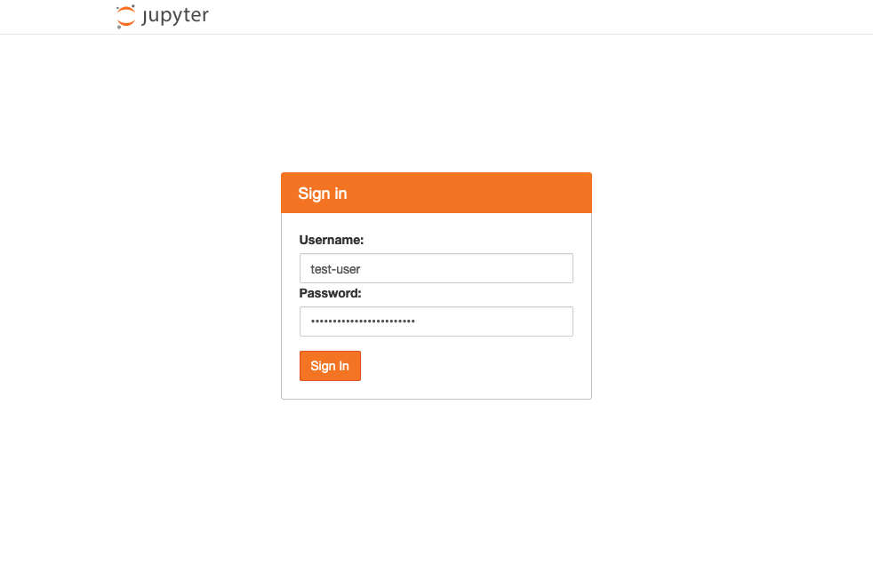
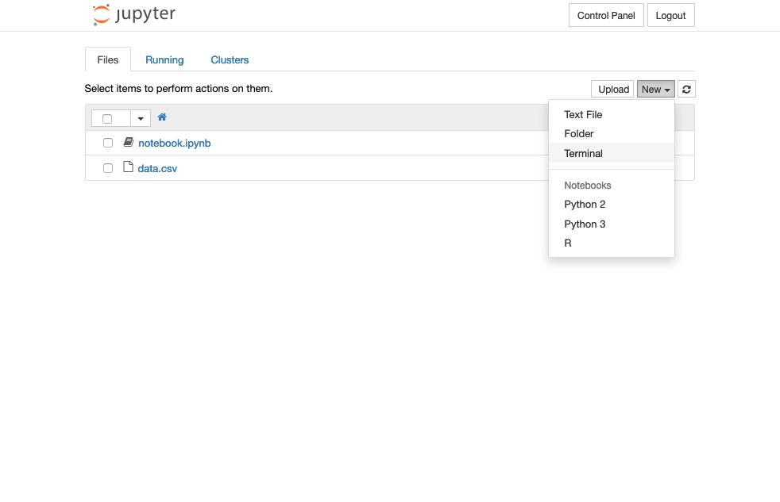
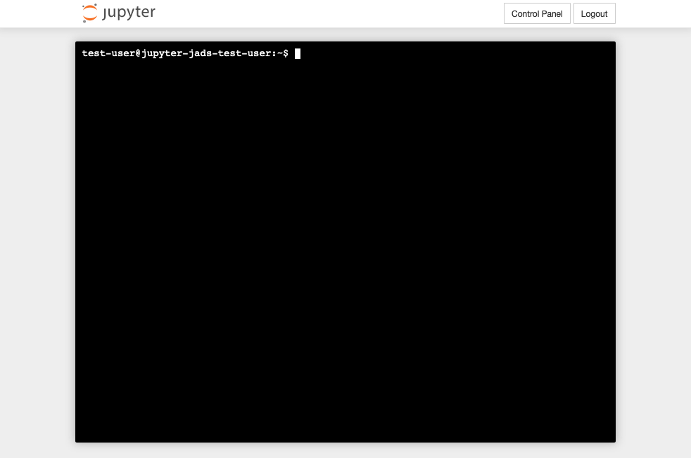
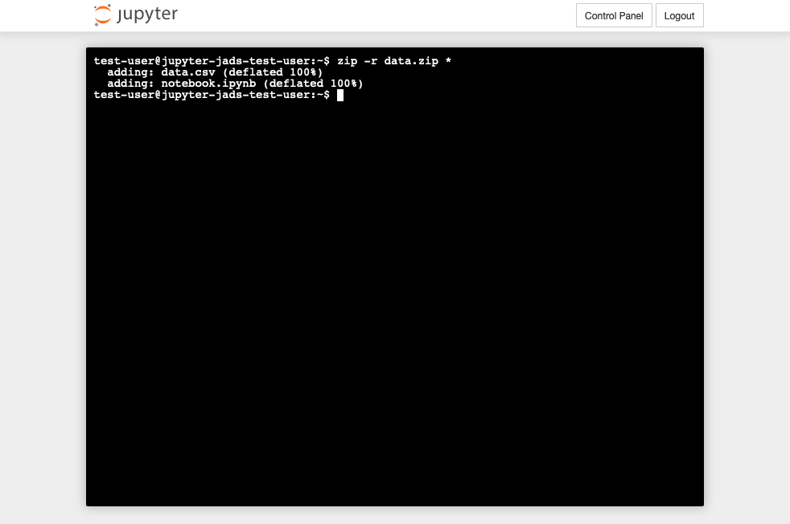
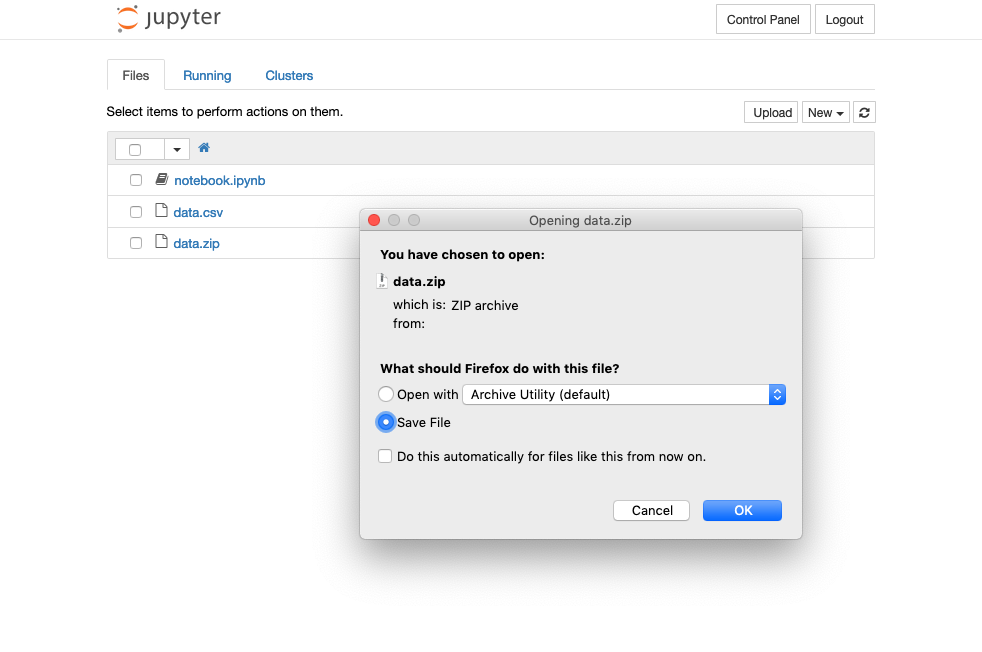
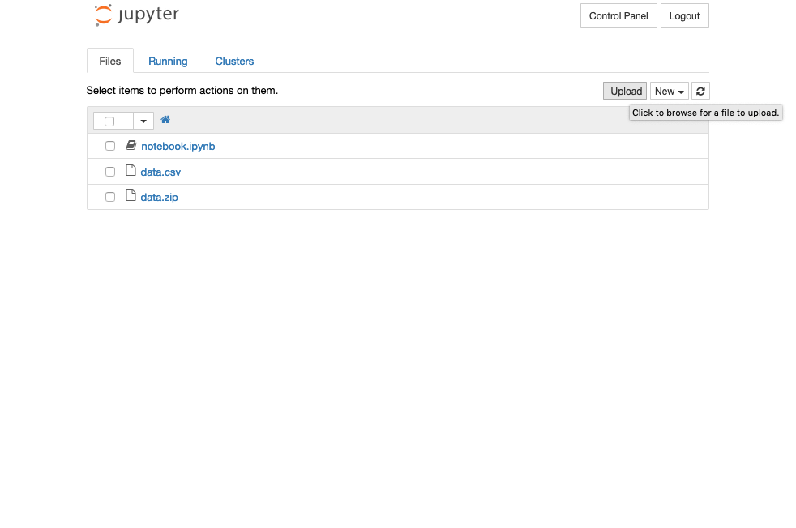
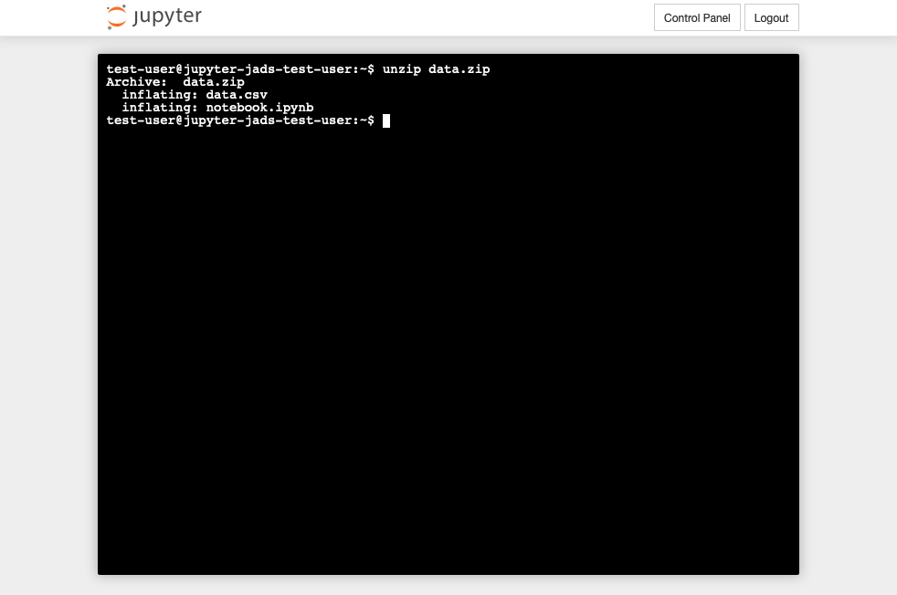
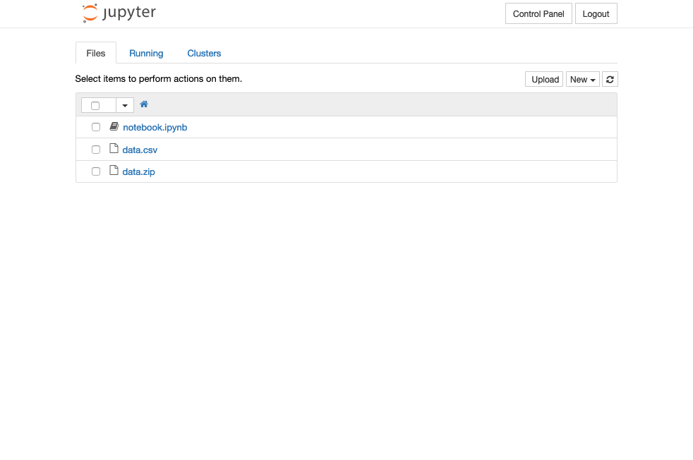

# Downloading your data
To download your user data from the SURFsara Jupyter notebook service for JADS, log in to the notebook environment via the Hub, using the username and password provided to you by JADS:

In the files overview, click on 'New' in the top-right of the screen, then 'Terminal':

A terminal will open in a new browser tab, looking as follows:

In the terminal type `zip -r data.zip *`, and press enter:

This command will add all files and directories in your home directory to a file called `data.zip`. When `zip` is finished, close the terminal tab in your browser.

In the files overview, you will now see `data.zip` appear. Click on this file, and a download dialog window will appear, allow you to save the file to your local disk:

## Reuploading individual files
After unzipping data on your local disk, individual files can reuploaded using the 'Upload' button in the files overview:

After clicking it, a file upload dialog will allow you to select a file, and upload it.

## Reuploading all files from your home directory
To upload **all files** from your original home directory, upload `data.zip`, and open another terminal. In the terminal, enter `unzip data.zip` and press enter:

After closing the terminal browser window, your files will show up in the files overview again:

