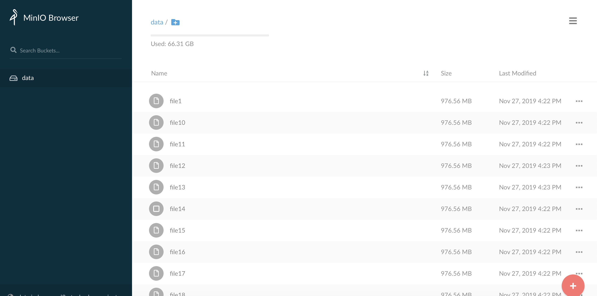

# MINIO Shared Data Storage

The Jupyter notebook service provides a MINIO shared data storage solution. This shared data storage solution can be used to share large data sets with an user. All data on the shared data storage will be available in users' notebook containers as a **read-only data set**.

Since the data on the shared storage is read-only, users should first copy the data to their home directory before they can modify the data.

The shared data storage is hosted through an S3-compatible object store called Minio, available in each Jupyter environment. The 'Shared data storage URL' of the object store for your environment will have been provided to you, as well as the 'Shared data storage access key' and 'Shared data storage access key' needed to log in. All data uploaded to the object store is synchronized to the machines on which notebook containers are running, and will be mounted automatically in users' notebook containers under `/data`.

This page explains how to upload data to the MINIO shared storage.

### Managing the shared data storage
There are several ways of managing data in the shared data storage: 
* Through the web interface
* Via an S3 client
* With the Minio command line client. 

These three options will be discussed below.

### The Minio web interface
The first is through the web interface available under the provided URL. After entering your access and secret key and logging in, you should see a web interface with a file browser. On the left side of the file browser will be a list of so-called *buckets*. The data storage will by default have a single bucket called `data`, listed on the left side of the screen. All data in this bucket will be available automatically in the users' notebook containers.

Clicking on the bucket `data` on the left side of the screen will show the contents of the bucket on the right side of the screen. Since this bucket is initially empty, you will not see any files listed until data has been uploaded.

To upload a file, click on the plus sign in the red circle in the bottom-right corner of the screen, and select upload file (the top option) in the menu that pops up. After selecting files to upload in the file selection dialog, Minio will upload the files one by one.

To delete a file, select the checkbox on the left side of the file name in the file browser, and select 'Delete selected' in the menu bar that pops up on the top of the screen.



**Please be aware that there is a file size limit of 128 MB when uploading files through the web interface. Upload larger files with an S3 client or with the Minio command line client (see below).**

### S3 client
The shared data storage is S3-compatible, and should be accessible with any S3-compatible client through the provided URL with the access and secret keys. Cyberduck is a popular storage client available for Windows and macOS, and downloadable from the Cyberduck [website](https://cyberduck.io/). The remainder of this subsection will explain how to manage the shared data storage with Cyberduck.

### Minio command line client
The Minio command line client, `mc`, is available for Windows, macOS and Linux. It can be downloaded from the [Minio website](https://docs.min.io/docs/minio-client-complete-guide). After downloading it, please make sure it is available on the path by modifying the `$PATH` environment variable.

First, add the data storage for the environment to the client using the URL, access key and secret key provided to you:

```bash
$ mc config host add alias URL ACCESSKEY SECRETKEY
```

Here, `alias` should be a name with which you will refer to the storage for this environment in the future. The name can be anything.

To copy a file called `data.csv` from your local machine to the `data` bucket in the shared data storage, use `mc cp`:

```bash
$ mc cp data.csv alias/data/data.csv
```

Here, `alias` in the command above should be replaced with the one you chose in the first command above.

To remove a file called `data.csv` from the `data` bucket, use `mc rm`:

```bash
$ mc rm alias/data/data.csv
```

As an administrator, you have full access rights on the `data` bucket. For more information about the functionality exposed by the Minio client, please see the [Minio client complete guide](https://docs.min.io/docs/minio-client-complete-guide).

#### Synchronization
Depending on the size of the data and the number of files in the shared data storage, synchronization to the different machines in the Jupyter cluster can take a while. During our experiments an upload+synchronization of 25 data files (1 GiB each) lasted around 20 minutes, but please be aware that depending on circumstances this may take more or less time. We advise you to upload the data several hours before the data will be used, so there will be enough time to synchronize all data.

To verify that the data has been synchronized, start a terminal in the Jupyter web interface (e.g. press "new">"terminal"). Run the following command:

```bash
$ ls -altr /data
```
When the result lists all files that were uploaded to the MINIO storage, the data has been successfully synchronized. Note, when files are still in the process of synchronization they are listed with the extension `.minio`.

#### Trouble Shooting

* Reaching the volume limit: to many users (PVC)
  When the following error appears, "...."

* Reaching the minio shared storage limit
  ...


