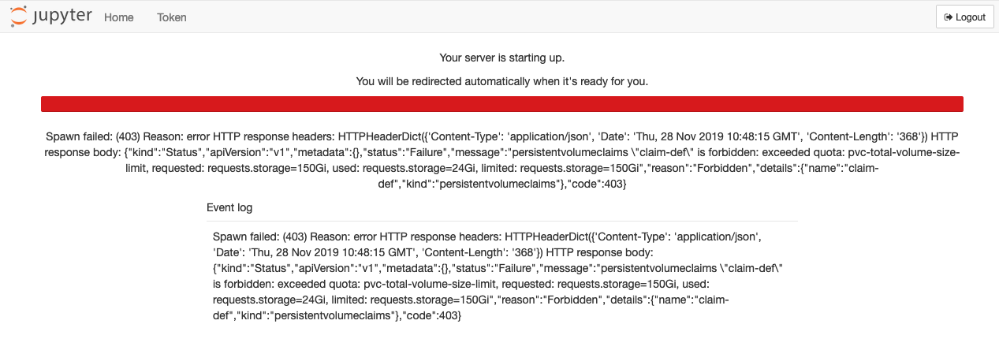

# Troubleshooting tips
This page describes a number of problems that can occur when using the Jupyter notebook service.

## Creating too many users
One of the possible reasons a notebook container cannot be started is caused by creating too many users. When a user submits their credentials and the notebook container starts, they might see an error like this:

The user limit is set when the environment is deployed. Although it is possible to create more than the allowed number of users, they will see the error above when logging in.

The only way to resolve this problem is to delete users through the [web portal](USERMANAGEMENT.md) or the [API](USERMANAGEMENT-API). It might take a few minutes for the environment to process the changes. When deleting users, their data will be deleted after some time. When the data has been cleaned up, new users can log in to the environment.
