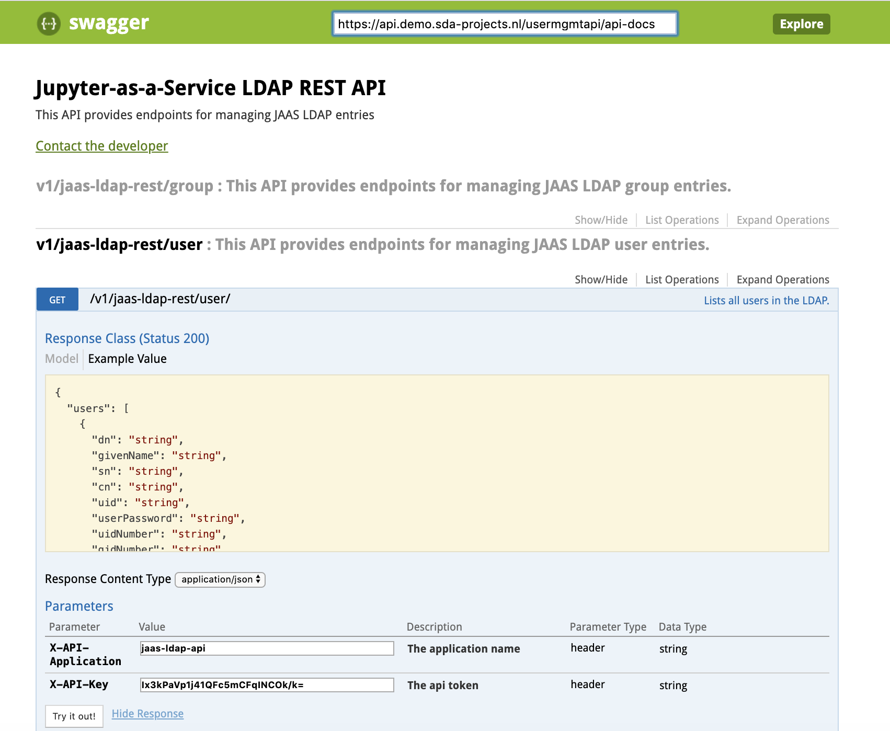
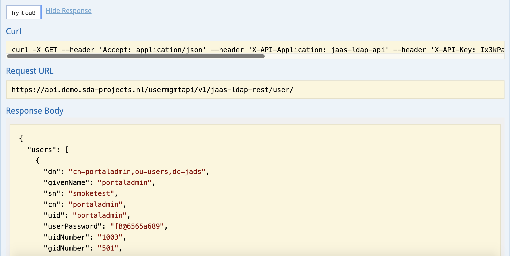
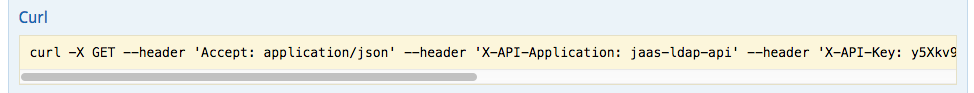

# User management API
The user management API is a public HTTP API which can be used to add, modify and delete Jupyter users. In contrast to the [web portal](USERMANAGEMENT.md), which offers an intuitive user interface, the user management API is usable  through scripting, with tools like [curl](https://curl.haxx.se/), or with the API user interface. The API is most useful when there is a need to quickly generate many new users based on a list of usernames and passwords, for example.

## Credentials
The 'User management API URL' to access the API will have been provided to you by SURFsara, as well as the 'User management API-key'. You will use the key to authenticate with the API, together with the *application*, which is given as `jaas-ldap-api`.

## API specifications
The HTTP API is built with [Swagger](https://swagger.io/), which provides a user interface to experiment with its functionality. Go to the provided URL, and you will see a list of API calls. There are two sets of API calls: those for managing groups, and those for managing users. Since group management is obsolete, we will not deal with it here, and we advise you not to make changes or delete the default groups. This can cause a malfunctioning environment.

## Getting a list of users
To list users through the user interface, click on *Expand Operations* below 'This API provides endpoints for managing JAAS LDAP user entries.' Then fill in the credentials as follows:

* **X-API-Application**: `jaas-ldap-api`
* **X-API-Key**: the API key provided to you by SURFsara



Click 'Try it out', and you should see a JSON response with all users currently in the user administration system.



To execute the same query from the command line with curl, copy the curl command from Swagger interface:



```bash
$ curl -X GET --header 'Accept: application/json'
--header 'X-API-Application: jaas-ldap-api'
--header 'X-API-Key: *********'
'https://api.demo.sda-projects.nl/usermgmtapi/v1/jaas-ldap-rest/user/'

{"users":[{"dn":"cn=laura,ou=users,dc=dev,dc=jove,dc=surfsara,dc=nl",
"givenName":"Laura","sn":"Leistikow","cn":"laura","uid":"laura",
"userPassword":"*******","uidNumber":"5001","gidNumber":"500",
"homeDirectory":"","loginShell":"","mail":"laura@dev.jove.surfsara.nl",
"employeeType":"portal"},{"dn":"cn=portaladmin,ou=users,dc=laura-dev,
dc=jove,dc=surfsara,dc=nl","givenName":"portaladmin","sn":"smoketest",
"cn":"portaladmin","uid":"portaladmin","userPassword":"*********",
"uidNumber":"1003","gidNumber":"501","homeDirectory":"/}
```

## Adding multiple users
To create multiple users, you can use your own HTTP client in your favourite programming language. The example below shows how to create multiple users with a Bash script.

First, create a Bash script called `add-multiple-users.bash`, by copy-pasting the following code into this file with a text editor. Make sure to set the `key` variable in the fifth line of the script to the API key that was provided to you.

```bash
#!/bin/bash

url="https://api.demo.sda-projects.nl/usermgmtapi/v1/jaas-ldap-rest/user/"
application="jaas-ldap-api"
key="******************"
input="users.csv"

while IFS=',' read -r f1 f2 f3 f4 f5
do
# Add user
curl -X PUT "$url" \
    -H "Content-Type: application/json" \
    -H "Accept: application/json" \
    -H "X-API-Application: $application" \
    -H "X-API-Key: $key" \
    --data @- <<END;
    {
       "givenName": "$f2", \
       "sn": "$f3",
       "cn": "$f1",
       "uid": "$f1",
       "userPassword": "$f4",
       "homeDirectory": "",
       "loginShell": "",
       "mail": "$f5",
       "employeeType": "portal"
    }
END

    done < "$input"
```

Second, a file containing our users, `users.csv`. This is a comma-separated values (CSV) file, with on each line the login name, first name, last name and password of each user we would like to add.

```
login1,firstname1,lastname1,password1
login2,firstname2,lastname2,password2
login3,firstname3,lastname3,password3
```

Third, run the `add-multiple-users.bash` script. The script will read the file created in the second step, and add all users with the API. Each time a user is added, the JSON response of the API will be printed.

```bash
$ chmod +x add_multiple_user.bash
$ ./add_multiple_user.bash
{"dn":"cn=login1,ou=users,dc=laura-dev,dc=jove,dc=surfsara,dc=nl",
"givenName":"firstname1","sn":"lastname1","cn":"login1","uid":"login1",
"userPassword":"[B@51bd4df5","uidNumber":"5002","gidNumber":"500","homeDirectory":"",
"loginShell":"","mail":"login1@laura-dev.jove.surfsara.nl",
"employeeType":"portal"}{"dn":"cn=login2,ou=users,dc=laura-dev,dc=jove,dc=surfsara,dc=nl",
"givenName":"firstname2","sn":"lastname2","cn":"login2","uid":"login2",
"userPassword":"[B@563c80fe","uidNumber":"5003","gidNumber":"500",
"homeDirectory":"","loginShell":"","mail":"login2@laura-dev.jove.surfsara.nl",
"employeeType":"portal"}{"dn":"cn=login3,ou=users,dc=laura-dev,dc=jove,dc=surfsara,dc=nl",
"givenName":"firstname3","sn":"lastname3","cn":"login3","uid":"login3",
"userPassword":"[B@582421cf","uidNumber":"5004","gidNumber":"500","homeDirectory":"",
"loginShell":"","mail":"login3@laura-dev.jove.surfsara.nl","employeeType":"portal"}
```

Finally, verify in the portal that the users have been created:


