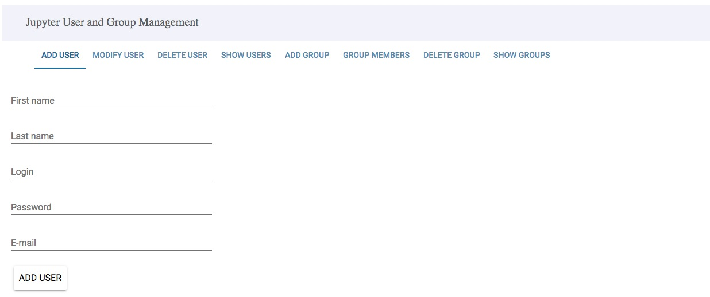
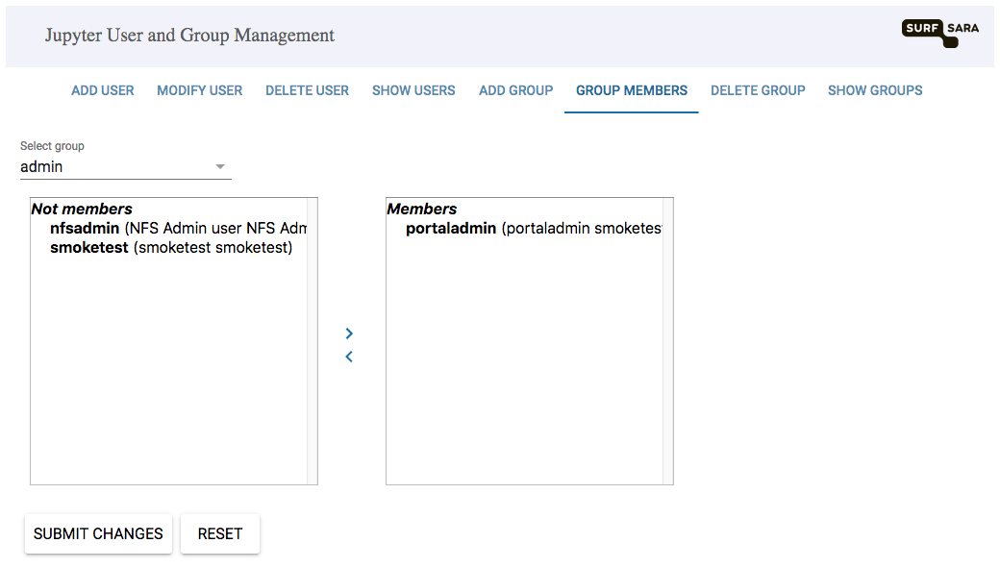
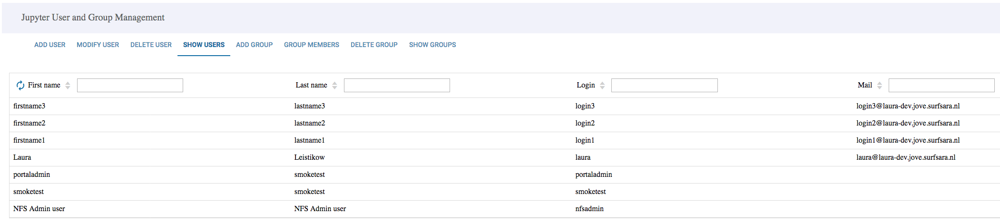

# User management
SURFsara's Jupyter notebook service offers two ways of managing users:

* The user management web portal
* The user management HTTP API

The web portal provides an easy-to-use web interface to add, modify and delete users for a Jupyter notebook environment. The HTTP API allows for control over user accounts through the use of scripting, allowing for the automated creation of a list of users, for example.

This page will explain how to manage users through the web portal. For instructions on using the API, see the [API documentation](USERMANAGEMENT-API.md).

## Managing users with the web portal
SURFsara will have provided you with the URL to access the user management web portal, as well as a username and a password to log in. After logging in, you will see a web interface with a number of tabs.

### Creating new users
Select the tab **ADD USER** to create new users, and fill out the following information:

* **First name**: first name of the user
  * Should not contain any special characters such as é, ö, etc.
* **Last name**: last name of the user
  * Should not contain any special characters such as é, ö, etc.
* **Login**: unique login name of the user to authenticate with JupyterHub
  * Only numbers and letters are allowed, and no spaces
* **Password**: password of the user
  * Minimum length of eight characters
  * Only letters and numbers are allowed
* **E-mail**: **should be left empty**

Click the 'ADD USER' button, and a notification should pop up.

The portal enables you to add users one by one. See the [API documentation](USERMANAGEMENT-API.md) to add multiple users at once.

By default, new users can only log into Jupyter notebooks through the JupyterHub and do not have access to the web portal.

### Users and administrators
By default, users are created in the `users` group. Anyone in the `users` group can log in through the JupyterHub, and start a notebook container. Members of the `admin` group can log in to the web portal and manage accounts. Initially there only a single administrator account for the web portal, which you will have been provided with.

Additional users can be made administrator by moving them to the `admin` group via the **GROUP MEMBERS** tab, as shown in the image below.

To make a user an administrator, click the user name in the left panel, and then on the right arrow '>'. Click the 'SUBMIT CHANGES' button, and the user will now be made an administrator.

### Updating, showing and deleting users
The tabs **MODIFY USER** and **DELETE USER** allow for updates to existing users, and deletion of users, respectively. The **SHOW USERS** tab will list all users and their groups, as shown in the following image.

### Adding, deleting and showing groups
Please do not use the group management tabs **ADD GROUP**, **DELETE GROUP** and **SHOW GROUPS**. Functionality provided by these tabs is kept online for legacy reasons, but will interfere with the proper functioning of the Jupyter environment.
